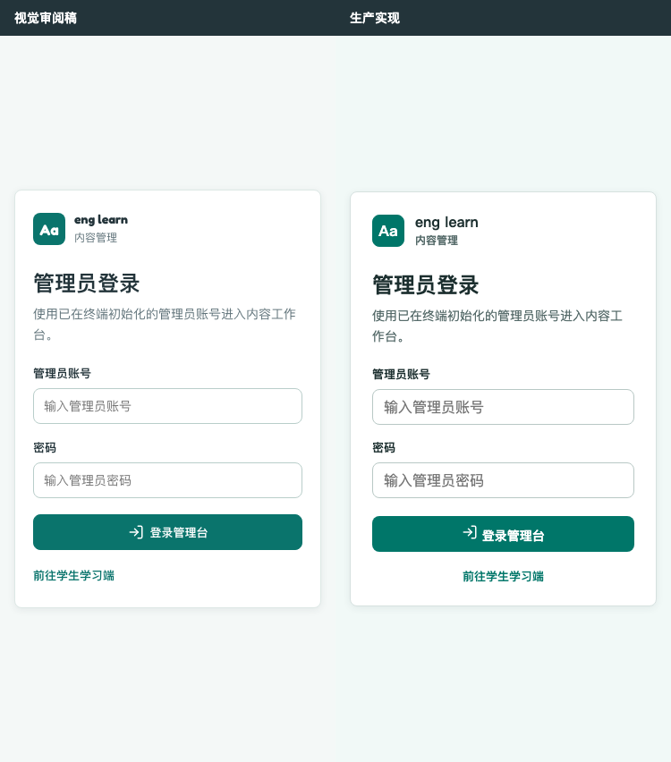
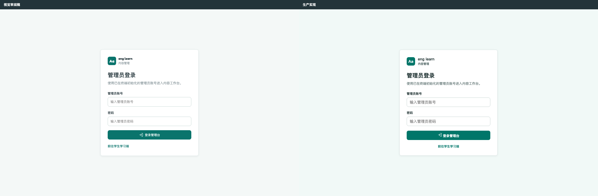
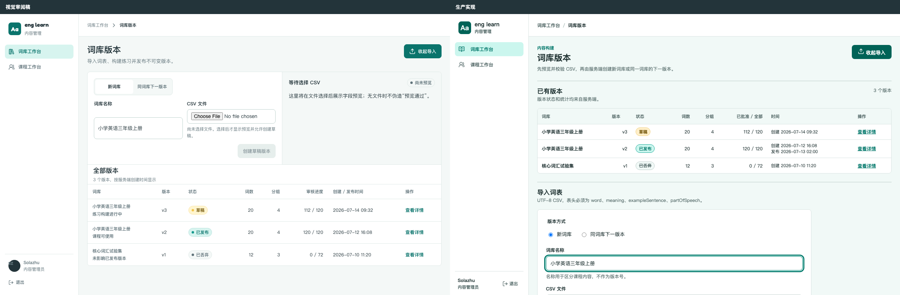
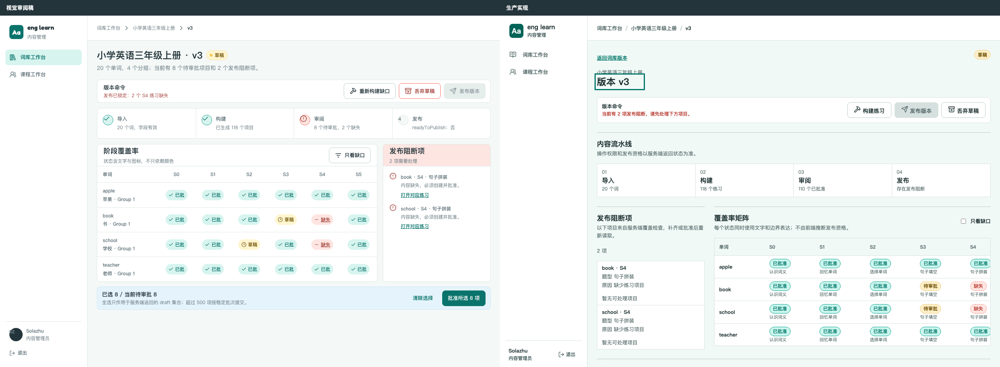
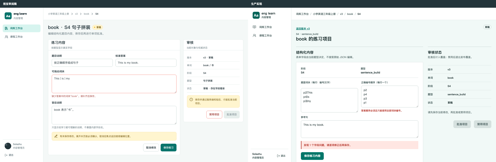
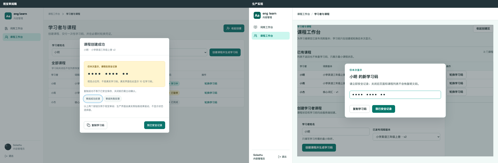

# PLAN_0714 管理员认证与高效内容工作台视觉验收报告

## 1. 文档信息

- 项目：eng-learn
- 验收对象：管理员登录、词库版本、版本详情、练习审核、课程工作台
- 验收依据：`pdoc/plan/PLAN_0714_管理员认证与高效内容工作台落地_v1.md`
- 视觉参考：`pdoc/design/DESIGN_0714_管理员登录与高效内容工作台视觉审阅稿_v1.html`
- 验收日期：2026-07-14
- 负责人：Solazhu
- 操作人：Solazhu
- 总状态：`passed`

## 2. 验收结论

本轮视觉验收通过。

六组同视口对照覆盖登录页的移动端与桌面端，以及词库版本、版本详情、练习审核、课程工作台四个桌面页面。生产实现保持了已确认的品牌语言、信息层级、状态表达和主要动作；35 个计划状态均有独立截图与汇总审阅稿。

本结论不表示生产实现与视觉审阅稿像素级完全一致。词库版本、版本详情、练习审核和课程工作台存在明确差异，其中一部分是实施计划优先于早期视觉审阅稿的有意调整，另一部分是未影响任务识别、操作路径或页面稳定性的非关键视觉微差。所有有意偏差均在下文逐页说明。

验收数据汇总：

| 项目 | 结果 |
| --- | --- |
| 同视口对照 | 6 组，共 18 个参考、生产和并排对照文件 |
| 状态截图 | 35 个状态，5 张状态汇总图 |
| `pageerror` | 0 |
| 非预期应用 Console 错误 | 0 |
| 预期资源级 Console 记录 | 17 条，均对应主动构造的 401、409、429、503 或断网状态 |
| 页面级横向溢出 | 0/35；所有状态均满足 `documentElement.scrollWidth === clientWidth` |
| 允许横向滚动区 | 10 个 `table-scroll` 记录、6 个 `table-scroll matrix-scroll` 记录 |

## 3. 证据清单

- 证据目录：[`pdoc/design/qa/PLAN_0714_管理员认证与高效内容工作台`](pdoc/design/qa/PLAN_0714_管理员认证与高效内容工作台/)
- 状态清单与运行数据：[`state-matrix.json`](pdoc/design/qa/PLAN_0714_管理员认证与高效内容工作台/state-matrix/state-matrix.json)
- 登录状态汇总：[`login-contact-sheet.png`](pdoc/design/qa/PLAN_0714_管理员认证与高效内容工作台/state-matrix/login-contact-sheet.png)
- 词库状态汇总：[`sources-contact-sheet.png`](pdoc/design/qa/PLAN_0714_管理员认证与高效内容工作台/state-matrix/sources-contact-sheet.png)
- 版本状态汇总：[`version-contact-sheet.png`](pdoc/design/qa/PLAN_0714_管理员认证与高效内容工作台/state-matrix/version-contact-sheet.png)
- 练习状态汇总：[`exercise-contact-sheet.png`](pdoc/design/qa/PLAN_0714_管理员认证与高效内容工作台/state-matrix/exercise-contact-sheet.png)
- 课程状态汇总：[`courses-contact-sheet.png`](pdoc/design/qa/PLAN_0714_管理员认证与高效内容工作台/state-matrix/courses-contact-sheet.png)

## 4. 逐页视觉验收

### 4.1 管理员登录

#### 375×812

#### 1280×800

| 验收项 | 记录 |
| --- | --- |
| 参考与实现差异 | 两个视口的卡片宽度、品牌区、标题、说明、双字段和主动作层级接近。生产实现的次要入口采用居中对齐，文字基线、卡片垂直位置和局部间距与参考存在轻微差异。 |
| 是否为计划优先级的有意偏差 | 否。次要入口对齐方式未被计划冻结，属于不影响登录路径与信息层级的非关键视觉微差。 |
| 修正结果 | 登录卡片在 375×812 与 1280×800 均完整显示；账号、密码、主动作和学生端入口无裁切，检查、提交、错误、冷却、未初始化、网络失败、服务异常、会话过期和已退出状态保持稳定占位。 |
| Console / `pageerror` | 10 个状态共 15 条资源级 Console 记录，来自预期的会话 401、冷却 429、服务 503 和断网夹具；非预期应用 Console 错误为 0，`pageerror` 为 0。 |
| 页面级横向溢出 | 10/10 状态均无页面级横向溢出，375px 视口下 `clientWidth` 与 `scrollWidth` 均为 375。 |
| 允许滚动区 | 无。登录页不依赖横向滚动。 |

### 4.2 词库版本工作台

| 验收项 | 记录 |
| --- | --- |
| 参考与实现差异 | 早期视觉审阅稿把导入区放在版本表格之前；生产实现把已有版本表格放入首屏，导入区由标题区动作展开并位于表格之后。生产表格使用真实字段与固定夹具数据，审核进度已对齐为 112/120、120/120 和 0/72。 |
| 是否为计划优先级的有意偏差 | 是。实施计划明确规定“已有版本时列表优先，空状态才默认展开导入”，因此生产实现优先于早期审阅稿的导入区顺序。 |
| 修正结果 | 已有版本、空状态、导入展开、CSV 预览成功、字段错误和自动确认中六个状态均可辨认；需要查看导入反馈的截图已滚动到对应区域，未以首屏截图掩盖下方状态。 |
| Console / `pageerror` | 仅“自动确认中”状态产生 2 条预期 503 资源记录，用于证明同一命令自动确认；非预期应用 Console 错误为 0，`pageerror` 为 0。 |
| 页面级横向溢出 | 6/6 状态均无页面级横向溢出，1280px 视口下 `clientWidth` 与 `scrollWidth` 均为 1280。 |
| 允许滚动区 | 已有版本、导入展开、预览成功、字段错误和自动确认中状态记录 `table-scroll`；当前夹具下容器宽度与内容宽度同为 1006px，没有实际溢出，但保留窄视口横向滚动能力。 |

### 4.3 版本详情工作台

| 验收项 | 记录 |
| --- | --- |
| 参考与实现差异 | 早期视觉审阅稿在双列区域中把覆盖率矩阵放在左侧、发布阻断项放在右侧；生产实现按命令条、内容流水线、发布阻断项、覆盖率矩阵的阅读顺序组织 DOM，并在 1280px 双列中把阻断项放在左侧、矩阵放在右侧。标题区和流水线的留白也比参考更克制。 |
| 是否为计划优先级的有意偏差 | 是。实施计划要求先解释阻断，再进入矩阵处理；DOM 顺序与视觉顺序保持一致，避免仅为复刻参考位置而破坏键盘与阅读顺序。 |
| 修正结果 | 未构建、存在阻断、可发布、发布确认、缺口筛选无结果和已发布只读六个状态均有稳定截图；命令条、流水线、阻断摘要和矩阵顺序一致，发布与只读状态没有混用写动作。 |
| Console / `pageerror` | 6 个状态的 Console 错误为 0，`pageerror` 为 0。 |
| 页面级横向溢出 | 6/6 状态均无页面级横向溢出，1280px 视口下 `clientWidth` 与 `scrollWidth` 均为 1280。 |
| 允许滚动区 | 六个状态均只允许 `table-scroll matrix-scroll` 横向滚动。未构建与存在阻断状态的矩阵为 706px 可视宽、900px 内容宽；其余状态为 941px 可视宽与内容宽。滚动被限制在矩阵内部，没有传递到页面根节点。 |

### 4.4 练习审核页

| 验收项 | 记录 |
| --- | --- |
| 参考与实现差异 | 早期视觉审阅稿使用简化字段“题目说明、标准答案、可拖动词块、答后说明”；生产实现按真实 `sentence_build` 结构展示题面词块、正确编号顺序和参考句，并保留右侧审核状态。生产表面比参考更扁平，字段含义更贴近实际数据契约。 |
| 是否为计划优先级的有意偏差 | 是。实施计划要求按题型展示真实结构化字段，不允许为视觉复刻退回简化字段或原始 JSON。 |
| 修正结果 | 768px 以上保持编辑区与审核区双栏；文本区高度已收口，保存动作在 1280×800 内完整可见。字段错误同时靠近字段并提供汇总；编辑、字段错误、并发冲突重读、批准、禁用和已发布只读状态层级稳定。dirty 截图只记录页面内未保存提示，原生离开确认不伪造成页面截图。 |
| Console / `pageerror` | 仅“并发冲突重读”状态产生 1 条预期 409 资源记录；非预期应用 Console 错误为 0，`pageerror` 为 0。 |
| 页面级横向溢出 | 7/7 状态均无页面级横向溢出，1280px 视口下 `clientWidth` 与 `scrollWidth` 均为 1280。 |
| 允许滚动区 | 无。双栏在当前视口内完成重排，不依赖横向滚动。 |

### 4.5 课程工作台

| 验收项 | 记录 |
| --- | --- |
| 参考与实现差异 | 生产实现把已有课程表格放在创建区之前，并使用真实可访问对话框与遮罩展示一次性学习码。对话框尺寸、标题文案、按钮间距和底层创建区位置与参考存在差异，但一次性凭证层级、遮罩格式和主要动作保持一致。 |
| 是否为计划优先级的有意偏差 | 是。实施计划要求已有课程时列表优先、创建区按需展开；一次性学习码必须由真实交互状态驱动，不能复刻审阅稿中的视觉状态选择器。 |
| 修正结果 | 无已发布版本、创建展开、一次性码、复制成功、复制失败和轮换确认六个状态均可辨认；长期截图只使用“•••• •••• ••”遮罩，不包含真实学习码。复制反馈位于对话框内，轮换确认靠近触发课程。 |
| Console / `pageerror` | 6 个状态的 Console 错误为 0，`pageerror` 为 0。 |
| 页面级横向溢出 | 6/6 状态均无页面级横向溢出，1280px 视口下 `clientWidth` 与 `scrollWidth` 均为 1280。 |
| 允许滚动区 | 创建展开、一次性码、复制成功、复制失败和轮换确认状态记录 `table-scroll`；当前夹具下容器宽度与内容宽度同为 1006px，没有实际溢出，但保留窄视口横向滚动能力。 |

## 5. 状态覆盖与流程健康

| 步骤 | 页面与状态 | 健康度 |
| --- | --- | --- |
| 1 | 登录：默认、检查、提交、凭证错误、冷却、未初始化、网络失败、服务异常、会话过期、已退出 | 通过；错误、恢复与成功退出的视觉状态可区分 |
| 2 | 词库：空状态、已有版本、导入展开、CSV 预览成功、字段错误、自动确认中 | 通过；列表优先与同命令自动确认状态均有证据 |
| 3 | 版本：未构建、存在阻断、可发布、发布确认、缺口筛选无结果、已发布只读 | 通过；流水线、阻断、矩阵和发布边界清晰 |
| 4 | 练习：编辑、字段错误、dirty 离开确认、并发冲突重读、批准、禁用、已发布只读 | 通过；字段反馈与权威状态重读有稳定位置 |
| 5 | 课程：无已发布版本、创建展开、一次性码、复制成功、复制失败、轮换确认 | 通过；一次性凭证与轮换风险均有明确反馈 |

## 6. 证据边界

- 本报告证明同视口视觉层级、状态可见性、页面级溢出和已记录的浏览器运行错误，不替代认证安全、D1 一致性、API 权限或远端 Worker CPU 验收。
- 截图不能单独证明完整键盘路径、屏幕阅读器语义或 WCAG 全量符合性；这些项目应以对应浏览器与组件测试结果为准。
- 原生 dirty 离开确认不会进入页面截图。对应 PNG 只证明 dirty 提示存在，原生对话框文案与取消/继续行为必须由真实浏览器行为断言证明。
- 视觉验收接受计划内的结构性调整与非关键微差，因此不作像素级完全一致声明。

## 7. 最终验收判定

`passed`

登录、词库版本、版本详情、练习审核和课程工作台均具备可审阅的参考对照、生产截图、状态覆盖与运行数据。未发现页面级横向溢出、`pageerror` 或非预期应用 Console 错误；所有可见结构差异已被确认是计划优先级调整或不影响任务完成的非关键微差。
