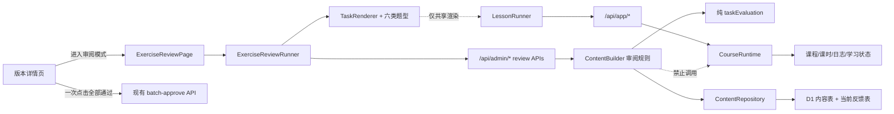

# PLAN_0717_学习版本双路径审阅与反馈重构闭环_v1

## 1. 文档信息

- 项目：eng-learn
- 文档类型：学习版本审批与审阅闭环实施计划
- 计划版本：v1
- 状态：已确认并完成本地实施验收；远端迁移与部署未授权
- 创建日期：2026-07-17
- 修改人：Solazhu
- 负责人：Solazhu
- 操作人：Solazhu
- 目标仓库：`/Users/solazhu/software/eng-learn`
- 上位依据：
  - `AGENTS.md`
  - `pdoc/plan/PLAN_0706_云端MVP后台构建与课时训练闭环_v1.md`
  - `pdoc/plan/PLAN_0714_管理员认证与高效内容工作台落地_v1.md`
  - `pdoc/plan/PLAN_0717_三层语境与学习阶段递进优化_v1.md`
  - `pdoc/rule/RULE_前后端代码规范_v1.md`
- 当前事实依据：
  - `pdoc/report/REPORT_0717_三层语境与学习阶段递进优化验收_v1.md`
  - `pdoc/report/REPORT_0717_词表导入迁移门禁与结果判定修复验收_v1.md`
- 官方依据：
  - https://developers.cloudflare.com/d1/reference/migrations/
  - https://developers.cloudflare.com/d1/worker-api/d1-database/
  - https://developers.cloudflare.com/d1/worker-api/prepared-statements/

## 2. 需求理解与实施结论

学习版本完成练习构建后，不再要求管理员在列表中逐项勾选、逐项批准。版本详情提供两条明确路径：

1. **进入审阅模式**：作为默认、主要路径。管理员使用与学生相同的六类题目交互逐题体验，提交后看到与学生一致的判定反馈，再决定“通过并下一题”或打开“反馈”。
2. **全部通过**：作为次要快捷路径。一次点击批准当前版本全部可批准草稿；界面不再要求全选，不增加二次确认，但必须保留现有 500 条分批上限、部分成功恢复和服务端校验。

“反馈”提供两个动作：

- **打回重构**：必须填写反馈内容；项目回到 `draft`，记录一条当前未处理反馈，不能批准、禁用或发布。
- **直接更正**：在审阅页打开现有结构化编辑器；保存后项目保持 `draft`，未处理反馈被解决，当前答题结果清空，必须重新体验后才能在审阅模式中通过。

本计划不把“打回重构”解释为自动重新生成练习。当前 `buildExerciseItems` 只补缺失项目，不覆盖已有项目；自动重建会覆盖人工修改并扩大生成规则范围。这里的“重构”固定指：项目回到可编辑草稿，由管理员按反馈修正，再重新审阅。

实施可行，但不是单纯增加两个按钮。必须同时处理审批状态、反馈持久化、内容并发版本、D1 迁移、任务渲染复用、判题复用、发布阻断和旧版本回滚。按本计划隔离后，不需要修改学生排课、阶段进退、课程、课时会话、答题日志或学习状态。

## 3. 严格调研范围与已确认事实

### 3.1 已审查范围

本次调研已沿以下真实调用链检查当前代码，而不是仅依据页面构想：

```text
版本详情页
  -> adminApi
  -> /api/admin/* 路由
  -> ContentBuilder
  -> ContentRepository
  -> D1 exercise_items / source_versions

学生练习页
  -> LessonRunner
  -> TaskRenderer
  -> /api/app/* 路由
  -> CourseRuntime / taskEvaluation
  -> lesson_sessions / lesson_tasks / review_logs / user_word_states
```

检查内容包括：

- 当前审批列表、全选、500 条分批和失败恢复逻辑。
- `draft / approved / disabled` 三态及发布覆盖检查。
- `content_revision` 乐观并发控制和已发布版本不可变规则。
- D1 与内存 repository 的练习读写边界。
- 六类 TaskRenderer、LessonRunner 和纯判题函数的依赖关系。
- 管理端与学生端 HTTP 分区、认证和路由边界。
- 迁移发布门禁、本地迁移测试和远端部署顺序。
- 现有组件、API、并发、D1、整栈和浏览器测试。

### 3.2 当前实现事实

1. `SourceVersionDetailPage.vue` 已支持选择草稿、全选、按 500 条稳定分批批准，以及后续批次失败后的权威重读。
2. `approveExerciseItemsRequestSchema` 把单次批准上限固定为 500。
3. 最新生产验收报告记录过 708 个草稿练习，已经超过单次上限；因此“全部通过”只能是一次用户点击、内部多批执行，不能假装成一笔原子事务。
4. `ExerciseItemStatus` 同时被共享 API、覆盖矩阵、ContentBuilder、D1 repository 和 `ExercisePackRecord` 使用。直接新增 `needs_rework` 会扩大所有这些边界。
5. `ContentBuilder` 的编辑会把项目设为 `draft`；批准前会重新校验题目内容；发布只允许覆盖完整且全部批准的草稿版本。
6. D1 练习写入通过 `source_versions.content_revision` 做比较并交换；并发变更会返回 `conflict`，并发发布会返回 `source_version_immutable`。
7. `TaskRenderer.vue` 只使用题目 ID、阶段、题型、提示和 S5 预览，却被类型绑定为包含 course/session 字段的 `LessonTaskDto`。
8. `LessonRunner.vue` 强依赖课程、课时会话、当前任务、恢复、提交、完成课时和学习端 API，不能用于管理端审阅。
9. `evaluateTaskSubmission` 是纯判题函数，可复用且不会写课程、课时或学习状态。
10. `CourseRuntime` 只允许已发布版本创建课程，并把批准练习复制为不可变 `lesson_tasks` 快照；管理端审阅不得进入这条链。
11. D1 当前按 `word_id, stage` 读取练习；UUID 的字典序不等于导入顺序。审阅顺序必须显式使用 `words.order_index, exercise_items.stage`。
12. 479px 及以下的管理页当前为只读，480px 起才允许构建、编辑、批准和发布；新审阅页必须遵守同一边界。

## 4. 耦合审计结论

| 受影响边界 | 直接复用或修改 | 风险 | 控制方式 |
| --- | --- | --- | --- |
| 版本详情审批区 | 修改 | 中 | 删除勾选交互，保留原批量 API、500 条分批和权威重读 |
| 练习状态枚举 | 不扩展 | 高 | 保持 `draft / approved / disabled`，反馈状态单独派生 |
| 练习主表 | 不新增反馈列 | 高 | 用独立一对一反馈表，避免污染所有 ExerciseItem 读写与旧 Worker |
| ContentBuilder | 小范围扩展 | 中 | 审阅规则仍归内容生命周期服务；不进入 CourseRuntime |
| D1 repository | 增加审阅专用查询和原子写入 | 高 | 每条写语句都受 draft + expected revision 条件保护 |
| TaskRenderer | 收窄输入类型 | 中 | 提取仅含渲染字段的 `TaskRenderDto`；LessonTask 仍结构兼容 |
| LessonRunner | 不复用、不修改 | 高 | 新建管理端 `ExerciseReviewRunner`，只复用题型渲染器 |
| 判题函数 | 复用 | 低 | 调用纯 `evaluateTaskSubmission`，不调用 CourseRuntime 提交 |
| 学生 API | 不修改 | 高 | 新接口全部位于 `/api/admin/*` |
| 课程和课时表 | 零写入 | 高 | D1 整栈测试比较审阅前后五张运行态表 |
| 发布覆盖 | 保留并加反馈门禁 | 中 | 打回强制 draft；发布前额外确认无未处理反馈 |
| 已发布版本与任务快照 | 不修改 | 高 | 审阅接口只接受 draft 版本；既有快照不回写 |
| 回滚到旧 Worker | 必须可读 | 高 | 新表独立；数据库触发器让旧审批路径失败关闭 |

### 4.1 不能采用的直接复用

- 不能在管理端创建临时 learner、course、lesson session 或 lesson task 来“模拟学生”。这会污染真实学习统计和调度状态。
- 不能把 `LessonRunner` 直接嵌入管理端。它不是纯展示组件，而是学生运行时协调器。
- 不能给 TaskRenderer 填假的 `sessionId`、`courseId`。应收窄渲染输入类型，保持契约真实。
- 不能把反馈只存在浏览器内。刷新后会丢失，批量批准也无法识别未处理问题。
- 不能只靠前端隐藏“批准”。现有单项批准和批量批准接口仍可能绕过，数据库必须有最终约束。

## 5. 目标、非目标与成功定义

### 5.1 目标

1. 版本构建后提供“进入审阅模式”和“一次点击全部通过”两条审批路径。
2. 审阅模式真实复用六类题目渲染和判题语义，但不产生任何学生运行态记录。
3. 管理员可对任一项目打回并留下 1 至 2,000 字符反馈。
4. 管理员可在审阅模式中直接结构化更正；保存后必须重新审阅，不自动批准。
5. 未处理反馈不能被单项批准、批量批准、禁用或发布绕过。
6. 审阅读写遵守 `content_revision`，不批准管理员未实际看到的并发新内容。
7. 已发布版本、既有课程和既有 lesson task 快照保持不变。
8. 新迁移可先于代码上线；代码回滚后旧 Worker 仍能读取旧表结构并失败关闭。
9. 通过单元、组件、D1、API、整栈和真实浏览器验收后才可声明完成。

### 5.2 非目标

- 不新增练习题型、学习阶段或评分规则。
- 不修改 StageEngine、LessonQueuePolicy、课时调度、错题回流或掌握度。
- 不自动重建被打回的练习，不覆盖已有人工编辑。
- 不保存管理员在审阅模式中的模拟答案、得分或审阅会话。
- 不做多人会签、审核人分配、评论线程、历史反馈审计或通知系统。
- 不改变 `exercise_items.status` 和 `exercise_packs.status` 枚举。
- 不把已批准等同于已发布；发布仍是独立动作并保留确认。
- 不新增依赖、AI、R2、语音、支付或多租户能力。
- 不在本计划阶段执行远端 migration、部署或生产数据写入。

### 5.3 完成定义

功能、数据约束、并发恢复、运行态隔离、迁移回滚、全量验证和视觉验收必须同时通过。只看到按钮或只通过组件测试不算完成。

## 6. 冻结的业务状态与不变量

### 6.1 练习持久化状态不变

```text
draft     可编辑、待审阅
approved  已批准、可进入发布覆盖
disabled  已禁用、阻断发布
```

### 6.2 审阅状态由项目状态和当前反馈派生

| exercise item 状态 | 当前反馈 | 派生审阅状态 | 允许动作 |
| --- | --- | --- | --- |
| `draft` | 无 | `pending_review` | 体验、直接更正、打回、批准 |
| `draft` | 有 | `needs_rework` | 查看反馈、更新反馈、直接更正 |
| `approved` | 无 | `approved` | 复查；草稿版本内可再次打回或更正 |
| `disabled` | 无 | `disabled` | 查看；草稿版本内可打回或更正 |

以下组合非法并必须被数据库阻止：

- `approved + 当前反馈`
- `disabled + 当前反馈`

### 6.3 状态转移

```text
构建
  -> draft + 无反馈
  -> pending_review

审阅通过
  -> approved + 无反馈

打回重构
  -> draft + 当前反馈
  -> needs_rework

实际修改 prompt 或 answer
  -> draft + 删除当前反馈
  -> pending_review
  -> 必须重新体验后再通过
```

### 6.4 硬不变量

1. 只有 `source_versions.status = 'draft'` 可执行审阅、反馈、更正或批准。
2. 反馈存在时项目必须是 `draft`。
3. 项目内容实际改变时，当前反馈自动解决并删除；未改变内容不能伪装成“已更正”。
4. 任何审批、打回或更正写入都必须只增加一次 `content_revision`。
5. 审阅页面拿到的 `contentRevision` 与操作时不一致，服务端返回 `conflict`，前端权威重读。
6. 预览和模拟答题不写 D1。
7. 审阅不创建 learner、course、lesson session、lesson task、review log 或 user word state。
8. 发布后不允许继续反馈或更正；需要修改时创建下一草稿版本。

## 7. 低耦合架构



### 7.1 服务边界选择

审阅仍属于“草稿内容构建、编辑、批准、发布”的同一生命周期，因此业务规则继续由 `ContentBuilder` 负责。新建第二个可独立修改项目状态的 service 会造成审批和编辑双重所有权，反而增加绕过风险。

`ContentBuilder` 只新增审阅读、模拟预览、模拟判题和审阅决定方法；学生运行态继续由 `CourseRuntime` 独占。D1 SQL 仍只进入 repository。

### 7.2 渲染复用选择

在 `shared/api/taskSchemas.ts` 新增仅面向渲染的 `TaskRenderDto` 判别联合，字段固定为：

```ts
type TaskRenderDto = {
  id: string
  stage: WordStage
  taskType: TaskType
  prompt: TaskPrompt
  preview?: SentenceOutputPreviewState
}
```

实际实现继续按六种题型保持严格联合，不使用宽泛 `unknown`。`LessonTaskDto` 在结构上满足该契约，因此学生页面不需要伪造或丢失 course/session 字段；管理端只返回真实存在的渲染字段。

## 8. 数据模型与 migration 0012

### 8.1 选择独立当前反馈表

新增：`migrations/0012_add_exercise_review_feedback.sql`

```sql
CREATE TABLE exercise_item_review_feedback (
  exercise_item_id TEXT PRIMARY KEY,
  feedback_text TEXT NOT NULL
    CHECK (length(trim(feedback_text)) BETWEEN 1 AND 2000),
  requested_at TEXT NOT NULL,
  FOREIGN KEY (exercise_item_id)
    REFERENCES exercise_items(id) ON DELETE CASCADE
);
```

不在表中重复保存 `source_version_id`。按版本查询时连接 `exercise_items`，避免两个版本 ID 不一致。主键已经满足按项目查询，不新增无用途索引。

该表只保存“一道题当前尚未处理的反馈”。再次打回同一题时使用 upsert 覆盖反馈正文和时间；内容实际修正后删除。第一版不承担历史审计职责。

### 8.2 数据库约束

migration 同时建立以下触发器，名称固定并纳入 migration 测试：

1. `exercise_item_review_feedback_requires_draft_insert`
   - 只有当前状态为 `draft` 的项目可插入反馈。
2. `exercise_item_review_feedback_requires_draft_update`
   - 只有仍为 `draft` 的项目可更新反馈。
3. `exercise_items_block_open_feedback_status_change`
   - 存在反馈时，禁止把项目状态改为 `approved` 或 `disabled`。
   - 抛出稳定标识 `exercise_item_review_feedback_open`，repository 映射为 HTTP 409 `review_feedback_open`。
4. `exercise_items_clear_feedback_after_content_change`
   - 仅当 `prompt_json` 或 `answer_json` 的实际值改变时删除当前反馈。
   - 只改状态、重复保存完全相同内容不得删除反馈。

### 8.3 迁移兼容性

- migration 只新增表和触发器，不改写 `exercise_items`、`source_versions`、课程或课时数据。
- 迁移后既有项目没有反馈，原状态、内容 JSON、数量和 `content_revision` 必须完全不变。
- 旧 Worker 不读取新表，也不需要识别新列；常规读取继续工作。
- 旧 Worker 若尝试批准带反馈项目，会被数据库阻止，数据安全优先于旧界面错误文案。
- 旧 Worker 实际修改题目内容时，触发器会解决反馈，随后可按旧流程批准。
- 不提供 down migration。代码回滚时保留 0012，避免删除反馈数据和破坏远端 migration 顺序。

### 8.4 原子写入要求

“打回重构”必须在同一个 D1 batch 中：

1. 在版本为 draft 且 revision 匹配时，把项目设为 `draft`。
2. 在相同条件下 upsert 当前反馈。
3. 在项目属于该版本且 revision 匹配时，把 `content_revision` 加一。

不能只在最后一条 revision SQL 做条件判断。每一条可能写数据的 SQL 都必须带相同的 draft + expected revision 守卫；否则 `changes = 0` 不会自动使前面语句失败，可能留下部分写入。

## 9. 最终 API 契约

所有接口继续经过现有管理员认证、Origin 校验和统一 `{ ok, data/error }` 响应；不新增 `/api/common/*` 或学生端接口。

### 9.1 读取审阅窗口

```http
GET /api/admin/source-versions/:versionId/review?itemId=:optionalItemId
```

严格响应：

```ts
type ExerciseReviewWindowDto = {
  sourceVersionId: string
  sourceName: string
  versionNo: number
  contentRevision: number
  totalCount: number
  approvedCount: number
  pendingCount: number
  needsReworkCount: number
  disabledCount: number
  allApproved: boolean
  firstItemId?: string
  previousItemId?: string
  nextItemId?: string
  current?: {
    id: string
    wordId: string
    word: string
    wordOrderIndex: number
    position: number
    stage: WordStage
    taskType: TaskType
    status: ExerciseItemStatus
    reviewState: ExerciseReviewState
    prompt: TaskPrompt
    feedback?: {
      text: string
      requestedAt: string
    }
  }
}
```

规则：

- 只允许读取 draft 版本的审阅窗口。
- 不传 `itemId` 时优先选择按固定顺序的第一项 `pending_review`；没有待审阅项目时再选择第一项 `needs_rework`，然后选择第一项 `disabled`。这样打回一题后可以继续审阅剩余草稿，不会反复停在同一反馈项。
- 全部 approved 时 `current` 为空并返回 `firstItemId`，界面显示完成态，可显式“从头复查”。没有练习时 `allApproved` 固定为 false。
- 传入 `itemId` 时必须属于路径中的版本，否则失败关闭。
- 顺序固定为 `words.order_index ASC, exercise_items.stage ASC`，即每个词按 S0 至 S5。
- 响应只包含 prompt，不包含 answer、courseId、sessionId、learnerId 或学习状态。
- repository 使用专用单项窗口查询和聚合计数，不在每次翻题时读取并解析全版本所有答案 JSON。

### 9.2 S5 模拟预览

```http
POST /api/admin/exercise-items/:itemId/review/preview
```

请求：

```ts
{
  expectedContentRevision: number
  taskType: 'sentence_output'
  draft: string // trim 后 1..2000
}
```

响应：

```ts
{
  exerciseItemId: string
  referenceSentence: string
  revealedAt: string
}
```

只返回参考句，不写预览状态。非 S5、题型不匹配、版本非 draft 或 revision 漂移均拒绝。由于第一版不持久化管理员模拟作答，S5 的“必须先预览再提交”由现有题型组件和审阅页交互状态保证，不伪装成服务端持久化不变量。

### 9.3 模拟判题

```http
POST /api/admin/exercise-items/:itemId/review/evaluate
```

请求：

```ts
{
  expectedContentRevision: number
  submission: SubmitTaskAnswerRequest
}
```

响应：

```ts
{
  exerciseItemId: string
  score: 0 | 1 | 2 | 3
  correct: boolean
  feedback: TaskAnswerFeedback
}
```

服务端复用 `evaluateTaskSubmission`。此接口不写 `review_logs`，也不更新阶段、队列或掌握度。`correct` 继续使用当前 `score >= 2` 语义。

### 9.4 审阅决定

```http
POST /api/admin/exercise-items/:itemId/review/decision
```

请求为严格判别联合：

```ts
type ExerciseReviewDecisionRequest =
  | {
      action: 'approve'
      expectedContentRevision: number
    }
  | {
      action: 'request_rework'
      expectedContentRevision: number
      feedback: string // trim 后 1..2000
    }
  | {
      action: 'correct'
      expectedContentRevision: number
      content: ExerciseItemContent
    }
```

响应：

```ts
{
  exerciseItemId: string
  sourceVersionId: string
  action: 'approve' | 'request_rework' | 'correct'
  status: 'draft' | 'approved'
  reviewState: 'pending_review' | 'needs_rework' | 'approved'
  contentRevision: number
}
```

决定规则：

- `approve`：只允许 draft、无反馈、内容合法且 revision 匹配；写为 approved。
- `request_rework`：draft/approved/disabled 均可在版本仍为 draft 时执行；统一变为 draft 并 upsert 当前反馈。
- `correct`：复用现有题型内容 schema 和 ContentBuilder 校验；保持阶段/题型身份不变；写为 draft；实际内容必须发生变化；解决当前反馈；不自动批准。
- 每次成功决定只增加一次 `content_revision`，响应返回新 revision。

### 9.5 现有接口兼容修改

- `POST /api/admin/exercise-items/batch-approve` 保留路径、请求上限和响应，不新增 approve-all API。
- 单项批准、批量批准和禁用在 service 层预查当前反馈；存在反馈返回新增错误 `review_feedback_open`，HTTP 409。
- 数据库触发器作为最终后盾，防止旧接口、旧 Worker 或遗漏调用点绕过。
- `publishVersion` 在现有 coverage 检查之外确认当前反馈数为 0；若异常存在，失败关闭。
- 现有编辑接口实际改变内容时自动解决反馈并保持 draft；原 API 响应结构不增加反馈字段。

## 10. 管理端交互方案

### 10.1 版本详情页

原“待审批练习”勾选列表改成“审阅与批准”行动区：

- 主按钮：`进入审阅模式`
- 次按钮：`全部通过（N 项）`
- 摘要：待审阅、需重构、已批准、已禁用数量
- 覆盖矩阵和单项“打开练习”入口保留
- 删除逐项 checkbox、全选 checkbox、已选数量和“批准所选项目”

“全部通过”启用条件：

1. 版本为 draft 且屏幕宽度至少 480px。
2. 至少有一个 draft 项目。
3. 无 `needs_rework` 项目。
4. 无 disabled 项目。
5. coverage 中不存在 missing、invalid 或其他非 `exercise_item_draft` 阻断。
6. 当前无其他版本写操作。

按钮一次点击立即执行，不弹确认框。内部按现有 500 条上限分批；成功后权威重读版本详情、覆盖率、练习列表和审阅摘要。

后续批次失败时不伪造回滚：显示已确认批准数，权威重读后保留剩余草稿，允许再次点击处理剩余项目。若重读也失败，清空可变业务视图并要求完整刷新。

### 10.2 审阅页路由

```text
/admin/source-versions/:versionId/review/:itemId?
```

- 继续位于 AdminGate 和 AdminLayout 下。
- 不新增学生身份或学生路由。
- 无 `itemId` 时由服务端选择第一项未通过项目。
- 成功决定后用响应与权威重读得到下一项目，并更新 URL，刷新可恢复当前位置。
- 不新增 review session 表；项目状态和反馈就是持久进度。

### 10.3 审阅页布局与行为

审阅页由薄页面 `ExerciseReviewPage.vue` 组合 `ExerciseReviewRunner.vue`：

1. 顶部显示词库、版本、当前位置 `x / total`、单词、阶段、题型和派生状态。
2. 中部使用现有 `TaskRenderer`，交互样式与学生题目一致。
3. S0-S4 提交后调用 evaluate；S5 先 preview，再提交 self score 并调用 evaluate。
4. 只有本页已完成一次成功 evaluate 后，`通过并下一题` 才在界面启用。
5. 该交互门禁是防误触体验，不伪装成安全边界；管理员仍拥有版本页“全部通过”能力。
6. `反馈` 按钮在答题前后都可使用，便于发现提示本身有问题时直接处理。
7. `上一题 / 下一题` 只导航，不改变状态。
8. 题目切换、revision 冲突或直接更正后，清空本地答案、判题反馈、S5 预览和“可通过”状态。

### 10.4 反馈面板

点击“反馈”打开可键盘操作、可 Escape 关闭、关闭后恢复焦点的面板：

- `打回重构`
  - textarea 必填，1 至 2,000 字符；显示计数和字段错误。
  - 成功后权威重读，确认状态为 `needs_rework` 且反馈文本一致，再前往下一未通过题。
- `直接更正`
  - 按需调用现有完整练习读取接口，显示 `ExerciseItemEditor`。
  - 保存时调用 `decision: correct`，而不是绕过审阅 revision 的普通编辑请求。
  - 成功后留在当前题，清空模拟作答状态，用新 prompt 重新体验。

有当前反馈的项目在题目上方显示反馈正文与时间；不能显示通过按钮。更新反馈仍使用 `request_rework`。

### 10.5 小屏边界

- 479px 及以下只显示版本、项目、状态和“请使用至少 480px 宽设备进行审阅”的提示。
- 不渲染可提交的题目控件、反馈输入、更正编辑器、通过或全部通过按钮。
- 480px 起恢复完整交互。

## 11. 并发、失败与恢复设计

| 场景 | 服务端结果 | 前端恢复 |
| --- | --- | --- |
| 打开题目后另一窗口修改内容 | `conflict` | 重读当前审阅窗口，清空旧答案，提示内容已变化 |
| 审阅中版本被发布/丢弃 | `source_version_immutable` | 重读版本并转只读/离开审阅，不重试写入 |
| approve 响应提交后丢失 | 结果未知 | 重读；仅当 revision 恰好为 expected + 1 且项目为 approved 时确认成功 |
| request_rework 响应丢失 | 结果未知 | 重读；仅当 revision 恰好为 expected + 1，且状态和标准化反馈都匹配时确认成功 |
| correct 响应丢失 | 结果未知 | 先重读完整项目，再读取内部一致的审阅窗口；仅当 revision 恰好为 expected + 1、内容匹配且无反馈时确认成功 |
| evaluate/preview 网络失败 | 无写入 | 保留本地输入并允许重试，不批准 |
| 批量第 2 批失败 | 部分成功 | 显示已确认数量，重读后只处理剩余 draft |
| 未处理反馈并发出现在批次中 | `review_feedback_open` | 停止后续批次，重读并引导进入审阅模式 |
| D1 不可用 | `dependency_failure` | 保留输入；禁用进一步写入，提供重读 |
| 审阅表未迁移 | 发布门禁应先阻止部署 | 若仍发生则 review API 失败关闭，不影响学生既有快照 |

任何写失败都不得自动用新 revision 重放原决定。若权威 revision 超过 expected + 1，即使最终内容或状态碰巧匹配，也不能归因于本次写入；必须让管理员基于新内容再次决定，防止批准未看过的并发修改。

## 12. TDD 竖切实施计划

本功能影响超过 8 个文件并横跨共享契约、前端、Worker、repository、D1 和测试。按四个可独立验证的竖切推进，不做跨层一次性大改。

### 阶段 A：把现有批量审批改为一次点击全部通过

价值：不依赖新迁移，先消除逐项勾选成本，并完整复用已经验收的批量安全机制。

先写测试：

1. 版本详情不再渲染全选和逐项 checkbox。
2. 一次点击 501 项时准确发出 500 + 1 两批请求。
3. 第二批失败时保留首批成功并权威重读。
4. published、archived、479px、无草稿或存在非草稿覆盖阻断时不显示/禁用动作。

最小实现：

- `approveSelected` 改为 `approveAllDrafts`，输入直接取当前权威 `draftItems`。
- 删除 selection 状态和列表交互，保留 chunk、成功计数、重读和失效关闭逻辑。
- 把审阅模式入口先路由到后续阶段新增页面；在阶段 B 完成前不合并不可达入口。

阶段验收：组件测试绿；既有发布、丢弃、构建和覆盖矩阵测试不回归。

### 阶段 B：建立无运行态写入的真实审阅路径

价值：即使尚未增加反馈，管理员也能按学生交互逐题体验并通过。

先写测试：

1. `TaskRenderer` 接受 `TaskRenderDto`，既有 LessonTask 六类渲染测试原样通过。
2. review GET 按 word order + S0-S5 返回单题 prompt，不返回 answer 或课程字段。
3. 六类 evaluate 返回与 `taskEvaluation.test.ts` 相同的 score/feedback。
4. S5 只有完成 preview 后界面才允许提交；服务端拒绝题型不匹配、revision 漂移和非 draft 版本。
5. 审阅批准与并发编辑/发布竞态返回正确 409。
6. 审阅前后课程运行态五张表的数量和内容不变。
7. 页面只有成功 evaluate 后才显示可用的“通过并下一题”。

最小实现：

- 新增审阅读、preview、evaluate 和 approve 决定的共享 schema、API client、路由和 ContentBuilder 方法。
- 新增 repository 单项窗口查询，不把全部答案传给浏览器。
- 新增 Review Page/Runner 并复用 TaskRenderer。
- 新增 admin 路由；不修改 LessonRunner、CourseRuntime 或 `/api/app/*`。

阶段验收：可完成 S0-S5 一轮体验与逐题批准；D1 运行态隔离测试绿。

### 阶段 C：增加反馈、打回和直接更正闭环

价值：完成用户要求的“有问题回到重构或直接更正，再重新审阅”。

先写测试：

1. 0001 至 0012 连续迁移成功，既有项目逐字段不变，新表为空。
2. 空白、超 2,000 字符、孤儿项目和非 draft 反馈被数据库/API 拒绝。
3. 打回 draft/approved/disabled 项都得到 `draft + needs_rework`，revision 只加一。
4. 有反馈时单项批准、批量批准、禁用和发布全部失败关闭。
5. 实际更正 prompt 或 answer 后反馈删除、状态 draft、revision 加一。
6. 相同内容的“直接更正”不解决反馈。
7. 打回、批准、更正与另一个编辑/发布并发时只有一个胜者。
8. 响应丢失后的三类权威重读都能区分已提交和未提交。

最小实现：

- 添加 0012、新 repository 反馈读写、数据库错误映射和 `review_feedback_open`。
- 扩展最终 decision 判别联合的 `request_rework` 与 `correct` 分支。
- 接入反馈面板和现有结构化编辑器。
- 版本详情接入派生审阅计数，按冻结条件控制“全部通过”。

阶段验收：反馈不能被任何旧入口绕过；直接更正后必须重新体验；旧 Worker 兼容测试通过。

### 阶段 D：视觉、整栈、迁移和交付收口

价值：把逻辑正确提升为真实可用、可发布、可回滚。

实施：

1. 编写 `pdoc/design/DESIGN_0717_学习版本双路径审阅与反馈闭环_v1.md`。
2. 编写可直接渲染的 `pdoc/design/DESIGN_0717_学习版本双路径审阅与反馈闭环视觉审阅稿_v1.html`。
3. 完成桌面和手机宽度的生产页面截图、对照图与视觉 QA 记录。
4. 完成全量测试、构建、制品扫描、Cloudflare 检查和 migration gate。
5. 编写 `pdoc/report/REPORT_0717_学习版本双路径审阅与反馈重构闭环验收_v1.md`。

阶段验收：真实浏览器操作、网络请求次数、D1 终态、控制台、响应式和键盘路径都有证据；未执行的远端步骤明确列为未验收，不用本地测试冒充生产验收。

## 13. 预计文件范围

### 13.1 生产代码与迁移

- `migrations/0012_add_exercise_review_feedback.sql`：当前反馈表和四个触发器。
- `shared/domain/content.ts`：`ExerciseReviewState` 与审阅领域 DTO 基础类型。
- `shared/api/contentSchemas.ts`：审阅窗口、preview、evaluate、decision 严格 schema；反馈上限常量。
- `shared/api/taskSchemas.ts`：`TaskRenderDto` 严格判别联合。
- `shared/api/schemas.ts`：新增 `review_feedback_open` API 错误。
- `server/http/apiResponse.ts`：错误映射为 409。
- `server/repositories/contentRepository.ts`：审阅窗口、反馈查询和原子打回接口。
- `server/repositories/d1ContentRepository.ts`：专用 SQL、反馈写入和触发器错误映射。
- `server/repositories/inMemoryContentRepository.ts`：与 D1 相同的反馈和 revision 语义。
- `server/services/ContentBuilder.ts`：审阅读取、模拟判题、决定规则及旧批准/禁用/发布反馈门禁。
- `server/http/adminRoutes.ts`：四个 admin review 路由。
- `src/api/adminApi.ts`：严格解析审阅请求与响应。
- `src/components/task-renderers/TaskRenderer.vue`：输入类型收窄，不改题型行为。
- `src/pages/admin/SourceVersionDetailPage.vue`：双路径入口、计数和一次点击全部通过。
- `src/pages/admin/ExerciseReviewPage.vue`：路由级页面和资源边界。
- `src/features/admin-content/ExerciseReviewRunner.vue`：模拟答题、反馈、更正、恢复和焦点行为。
- `src/app/router/index.ts`：可选 itemId 的管理员审阅路由。

### 13.2 测试与文档

- 新增 `tests/unit/exerciseReviewMigration.test.ts`。
- 新增 `tests/unit/d1ExerciseReview.test.ts`。
- 扩展 `tests/unit/contentApiSchemas.test.ts`。
- 扩展 `tests/unit/contentBuilder.test.ts`。
- 扩展 `tests/unit/apiContentConcurrency.test.ts`。
- 扩展 `tests/unit/adminApi.test.ts`。
- 扩展 `tests/unit/d1ContentBuildBudget.test.ts` 的 migration 清单和硬上限验证。
- 扩展 `tests/component/task-renderers/TaskRenderer.test.ts`。
- 扩展 `tests/component/admin/SourceVersionDetailPage.test.ts`。
- 新增 `tests/component/admin/ExerciseReviewPage.test.ts`。
- 扩展 `tests/component/router/appRouter.test.ts`。
- 扩展 `tests/e2e/stack/full-loop.spec.ts`。
- 扩展 `tests/e2e/ui/admin-visual-qa.spec.ts` 或增加同级审阅场景。
- 新增本计划第 12 阶段 D 的设计、视觉 QA 和验收报告。

不得顺手重构不相关页面、队列、课程、登录或导入代码。每个修改行必须能回溯到本计划目标。

## 14. 测试矩阵

### 14.1 正常路径

| 层级 | 必测行为 |
| --- | --- |
| Schema | 四个 review API 的合法请求/响应全部 strict parse |
| Service | 六类题型 preview/evaluate/approve；打回；直接更正 |
| Repository | 单项窗口顺序、计数、反馈 upsert、revision 原子递增 |
| Component | 两条审批路径、答题后通过、反馈面板、更正后重答 |
| API | admin 认证后完整闭环，app API 无变化 |
| D1 | 反馈约束、触发器、批量批准、发布前置条件 |
| Stack | 构建 -> 审阅 -> 打回 -> 更正 -> 重审 -> 全部批准 -> 发布 |
| Browser | 真实点击、焦点、反馈文本、刷新恢复、桌面/手机 |

### 14.2 错误路径

- 未登录、过期管理员会话、错误 Origin。
- 不存在版本、项目不属于版本、版本非 draft。
- 空反馈、纯空白反馈、2,001 字符反馈。
- preview/evaluate 题型与项目不一致。
- S5 组件在未预览时不能发出提交；刷新或切题后预览状态必须清空。
- revision 过期、并发编辑、并发批准、并发发布、并发丢弃。
- 未处理反馈下的 approve、batch approve、disable、publish。
- D1 batch 任一步骤注入失败，确认没有部分写入。
- 网络响应在服务端提交前丢失和提交后丢失两种情况。
- 权威重读再次失败时页面停止显示可变陈旧状态。

### 14.3 边界路径

- 0 个练习：显示先构建，不显示可执行审阅决定。
- 1 个练习：无 previous/next，完成后正确进入完成态。
- 500 个草稿：一次 batch。
- 501 个草稿：两批 500 + 1。
- 当前记录过的 708 个草稿：两批 500 + 208。
- 当前产品上限 500 词，即 3,000 个练习：review GET 仍只返回一个 prompt；全部通过为 6 批。
- 10 倍于 708 的 7,080 项超出当前 500 词导入硬上限，不作为可生产输入；通过 3,000 项硬上限测试和专用单项查询保证本功能不引入全答案 payload 放大。
- 反馈正好 1、2,000 字符；Unicode、换行和中英文混合。
- S0 至 S5 每种题型各一项，v1/v2 的 S1/S2 合法映射都覆盖。
- 479px 完全只读，480px 完整可操作。

### 14.4 不回归路径

- 旧 v1 exercise item 和 lesson task 仍能解析、作答和报告。
- v2 三层语境任务仍按现有映射渲染和判题。
- 课程仍只能绑定已发布版本。
- 既有 lesson task 快照不受草稿审阅影响。
- 构建仍只补缺失项目，不覆盖反馈项目。
- 原单项编辑、批准、禁用、发布、丢弃的响应丢失恢复仍通过。
- 学生 LessonRunner 全量组件测试原样通过。

## 15. 验证命令与证据

### 15.1 定向红绿测试

```bash
pnpm exec vitest run --config vitest.config.ts \
  tests/unit/exerciseReviewMigration.test.ts \
  tests/unit/d1ExerciseReview.test.ts \
  tests/unit/contentApiSchemas.test.ts \
  tests/unit/contentBuilder.test.ts \
  tests/unit/apiContentConcurrency.test.ts \
  tests/unit/adminApi.test.ts \
  tests/unit/adminReviewRoutes.test.ts \
  tests/unit/d1ContentRepository.test.ts \
  tests/unit/apiSecurityWorkflowV2.test.ts

pnpm exec vitest run --config vitest.component.config.ts \
  tests/component/task-renderers/TaskRenderer.test.ts \
  tests/component/admin/SourceVersionDetailPage.test.ts \
  tests/component/admin/ExerciseReviewPage.test.ts \
  tests/component/router/appRouter.test.ts
```

### 15.2 全量本地门禁

```bash
pnpm typecheck
pnpm lint
pnpm test
pnpm build
pnpm scan:artifacts
pnpm cf:check
pnpm cf:types:check
git diff --check
```

### 15.3 D1 与整栈

```bash
pnpm db:migrate:local
pnpm test:e2e:stack
```

整栈证据必须记录：

- 审阅前后 `courses`、`lesson_sessions`、`lesson_tasks`、`review_logs`、`user_word_states` 的行数和关键字段完全一致。
- 只允许 `exercise_items.status`、`exercise_item_review_feedback` 和 `source_versions.content_revision` 按预期变化。
- 708 项或等价 501+ 夹具的真实请求数、每批数量和最终批准数量。

### 15.4 浏览器验收

```bash
pnpm test:e2e:ui
```

必须实际核验：

- 1280x900：版本详情双路径、六题型审阅、反馈、更正、完成态。
- 375x812：没有任何可变入口和可提交题目控件。
- 键盘：Tab 顺序、反馈面板焦点、Escape 关闭、关闭后恢复触发按钮。
- 屏幕阅读：状态变化使用 `role=status/alert` 或等价 live region。
- 控制台无未处理异常；网络中审阅使用 `/api/admin/*`，无 `/api/app/*` 和课程写请求。
- 每个决定后只发生一次写请求，随后权威重读；不得因双击或重复事件发出重复决定。

### 15.5 远端发布前门禁

```bash
pnpm db:migrations:check:remote
```

新增 0012 后，该命令在远端未迁移时必须失败。只有获得单独授权、明确核对数据库身份并成功应用 0012 后，才能执行：

```bash
pnpm release:deploy
```

## 16. 验收标准

### 16.1 功能验收

- [x] 构建完成的 draft 版本显示“进入审阅模式”和“全部通过（N 项）”。
- [x] 不再需要全选或逐项勾选。
- [x] 一次点击可处理超过 500 项，并如实处理部分成功。
- [x] 审阅模式逐题呈现学生同款六类交互和判题反馈。
- [x] 未提交模拟答案时，界面不能直接误触“通过并下一题”。
- [x] 反馈可打回并持久化，刷新后仍存在。
- [x] 直接更正使用结构化字段，保存后不自动批准并要求重审。
- [x] approved/disabled 项目在版本仍为 draft 时可重新打回或更正。
- [x] 全部 approved 后显示完成态并可返回版本发布。

### 16.2 数据与安全验收

- [x] `ExerciseItemStatus` 仍只有 draft/approved/disabled。
- [x] migration 0012 不改写任何既有练习、版本、课程或课时行。
- [x] 当前反馈与 approved/disabled 不能同时存在。
- [x] 未处理反馈不能通过任何现有或新增入口被批准、禁用或发布。
- [x] 每次内容决定只增加一次 content revision。
- [x] 审阅 preview/evaluate 零 D1 写入。
- [x] 整个审阅闭环零学生运行态写入。
- [x] published/archived 版本的审阅写入全部失败关闭。
- [x] prompt-only 响应在提交前不泄露 answer。

### 16.3 质量与交付验收

- [x] 定向、全量、D1、整栈、浏览器、构建和制品扫描全部通过。
- [x] 479/480 响应式边界、键盘和 live region 通过。
- [x] Feature Guide、设计文档、可渲染视觉审阅稿、QA 证据和正式 REPORT 齐全。
- [x] 未做的生产迁移、部署或生产数据验收被明确标记，不能以本地结果代替。
- [x] 本次实现改动均可追溯到本计划；用户已有提交和无关工作区改动未被回退或覆盖。

## 17. 发布、迁移与回滚

### 17.1 发布顺序

1. 在隔离的本地 D1 从 0001 连续应用到 0012，执行迁移兼容测试。
2. 完成代码与全量本地验收。
3. 获得单独远端迁移授权。
4. 只读核对目标数据库身份和当前 migration 顺序。
5. 应用 0012。
6. 重新执行 `pnpm db:migrations:check:remote`，确认完全一致。
7. 部署 Worker/前端。
8. 用一个非发布草稿完成审阅、打回、更正、批准 smoke；不动既有已发布版本和课程。

先迁移后代码是硬要求。新表独立且旧代码可忽略；反向顺序会让 review API 在表不存在时失败。

### 17.2 代码回滚

- 回滚 Worker/前端代码，但保留 0012。
- 旧代码继续读写原 exercise item 结构。
- 有未处理反馈时旧批准/禁用会被触发器阻止，属于预期失败关闭。
- 如必须在旧代码下继续处理，先实际编辑问题项目；内容改变会清除反馈，再按旧流程批准。
- 不删除表、不删除触发器、不手工改 migration 记录。

### 17.3 数据异常处置

若上线后发现以下任一情况，立即停止新审阅写入并回滚代码：

- 课程、课时、日志或学习状态因审阅发生变化。
- 同一次决定使 revision 增加多次或留下部分写入。
- 带反馈项目成为 approved/disabled。
- 已发布版本可被反馈或更正。
- prompt-only API 泄露 answer。

保留 0012 和现场数据，先做只读审计；不得通过删除反馈表掩盖问题。

## 18. 风险、脆弱假设与控制

| 风险或假设 | 影响 | 控制 |
| --- | --- | --- |
| 当前仅需单管理员、单条当前反馈 | 后续多人审核缺历史和归属 | 第一版明确不做审计；若需求改变，另建 append-only review event 表，不在本表硬塞 reviewer 字段 |
| 用户要求“一次点击直接全部通过” | 容易误触 | 按钮置为次要动作、显示数量、严格启用条件；不增加违背需求的二次确认 |
| 超过 500 项不是单事务 | 可能部分成功 | 复用稳定分批、累计确认数、停止后续批次、权威重读 |
| TaskRenderer 类型收窄影响学生页 | 六题型回归 | 先跑现有 TaskRenderer 与 LessonRunner 全量组件测试，再接管理端 |
| 数据库触发器异常映射 | 旧入口可能显示泛化错误 | repository 映射稳定触发器标识；API 增加 review_feedback_open |
| 反馈表缺少历史 | 无法追溯多轮反馈 | 当前产品只承诺当前待处理反馈；不伪装成审计日志 |
| 管理员故意答错用于看反馈 | 答题得分不能自动决定审批 | 模拟判题只供检查；审批始终由明确按钮决定 |
| 浏览器刷新丢失本地模拟答案 | 需要重新体验当前题 | 不持久化审阅答案，避免建立第二套学习运行态；项目状态和反馈可恢复 |

最脆弱假设是“第一版不需要多人审阅历史”。如果在实施前确认需要知道谁在何时提出、解决了每一轮反馈，本计划的数据模型不再适用，必须停止并改为 append-only 审阅事件模型。

## 19. 已否决方案

### 19.1 直接复用学生 CourseRuntime

否决原因：会创建真实课程/课时/日志/学习状态，混淆内容质检和学生学习，影响调度统计，违反 admin/app 分区。

### 19.2 直接复用 LessonRunner

否决原因：LessonRunner 是课程运行时协调器，不是纯题目 UI。复用会引入 session/current task/complete lesson/recovery 等无关依赖。

### 19.3 给 `ExerciseItemStatus` 新增 `needs_rework`

否决原因：该枚举横跨 pack、覆盖矩阵、API、service、D1 和发布；反馈是审批上下文，不应扩大练习生命周期枚举。

### 19.4 在 `exercise_items` 增加多个反馈列

否决原因：会迫使构建、批量序列化、内存仓储、旧 Worker 和所有项目 DTO 理解反馈字段；独立一对一表的耦合和回滚风险更低。

### 19.5 建立持久化 review session 和模拟答案日志

否决原因：用户只要求逐题审阅和反馈。持久化模拟作答会复制一套学生运行态，增加恢复、幂等、清理和隐私边界，没有当前价值。

### 19.6 新增服务端 approve-all 接口

否决原因：现有 500 条 batch API 已有校验、并发和失败恢复测试。新增全版本大事务会碰到请求/查询预算并重复能力；一次用户点击不等于必须新增一个服务端端点。

## 20. 外部依赖、权限与停止条件

### 20.1 外部依赖

- 不新增 npm 包、外部服务、API key、R2、AI 或第三方账号。
- 实施只依赖当前 Vue、TypeScript、Vitest、Playwright、Workers、D1 和 Wrangler。
- 远端迁移与部署依赖现有 Cloudflare 凭据，但本计划不授权使用。

### 20.2 必须停止并提交 REPORT_CONFLICT 的条件

出现以下任一事实时，不得按本计划继续编码：

1. 产品要求保存多轮反馈历史、审核人身份或多人会签。
2. “打回重构”被确认必须自动重新生成并覆盖现有题目。
3. 审阅得分被要求自动驱动批准，而不是管理员明确决定。
4. 已发布版本被要求原地反馈、更正或重新批准。
5. 审阅必须复用真实学生课程和学习数据。
6. 现有规则、上位 PLAN 或当前代码发现与本计划硬不变量冲突。

## 21. 下一步授权边界

用户已确认以下主框架并授权本地开发与严格验证：

```text
默认进入独立管理端审阅
  + 次要的一次点击全部通过
  + 当前反馈一对一持久化
  + 打回不自动生成
  + 直接更正后必须重审
  + 学生运行态零写入
```

本地实施与验收结果记录于 `pdoc/report/REPORT_0717_学习版本双路径审阅与反馈重构闭环验收_v1.md`。远端 migration、部署和生产 smoke 仍必须分别获得明确授权。
